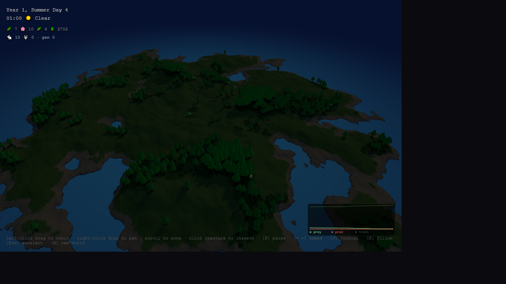
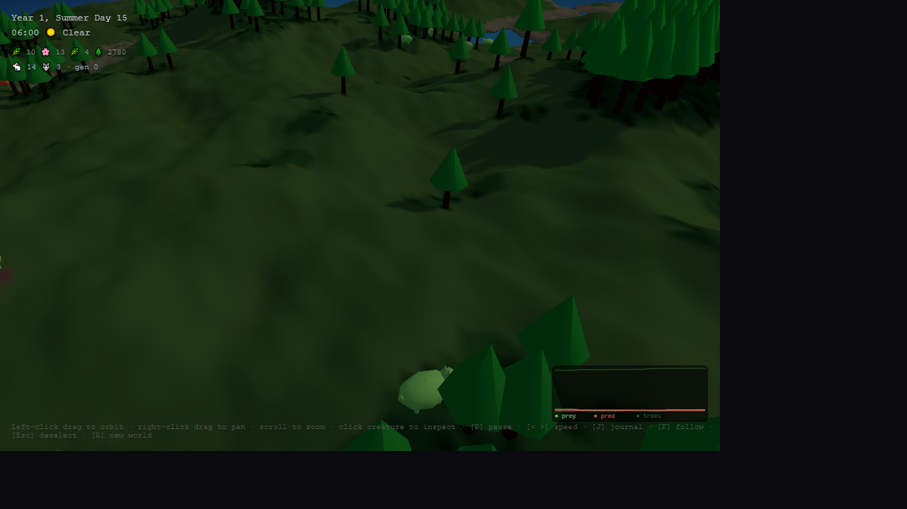

# Drift

> **Disclaimer:** This project is entirely vibe coded. No grand architecture, no design docs, no tests — just vibes. Proceed accordingly.

**A persistent generative world that evolves while you're away.**

Drift is an artificial ecosystem simulation that runs in your browser. It generates a procedural island with terrain, water, weather, and plant life — and it keeps changing even when you close the tab. When you return, you discover what happened in your absence.

## The Idea

Most simulations pause when you stop watching. Drift doesn't.

Close your tab for an hour, and when you return, years have passed in the world. Forests have grown or receded. Rivers have shifted course. Seasons have cycled dozens of times. The world doesn't need you — but it rewards you for coming back.

<p align="center">
  
</p>

<p align="center">
  
</p>

## Features

- **3D terrain** — Height-mapped mesh with real elevation rendered in WebGL via Three.js. Orbit, pan, and zoom around the world
- **Procedural terrain** — Unique island generated from a random seed with oceans, beaches, grasslands, forests, mountains, and snow
- **Animated ocean** — Semi-transparent water plane with wave vertex shaders and daylight-reactive coloring
- **Dynamic water** — Rain fills valleys, water flows downhill, erosion slowly reshapes the landscape over centuries
- **Living flora** — Grass, flowers, bushes, and trees grow, spread, compete, and die according to biome, season, and conditions
- **Fauna with evolution** — Herbivores graze on plants, predators hunt herbivores. Each creature has a genome (speed, size, vision, metabolism, camouflage). Offspring inherit traits with mutation — natural selection emerges over generations
- **Predator-prey dynamics** — Population graph tracks the classic Lotka-Volterra oscillations in real time. Watch herbivore booms trigger predator surges, then crashes
- **Creature inspection** — Click any creature to see its diet, state, energy, age, generation, and full genome breakdown with visual bars
- **Camera follow** — Lock the camera onto a creature and watch its journey in real time
- **World event journal** — A running log of notable events: population surges, crashes, deforestation, famines, generation milestones, and season changes
- **Speed controls** — Run the simulation at 1x, 2x, 5x, or 10x speed
- **Weather & seasons** — Rain systems roll through as 3D particle streams, temperatures shift, and the cycle of spring through winter shapes all life
- **Day/night lighting** — Directional sun that arcs across the sky, warm dawn/dusk tones, blue-tinted night with hemisphere and ambient fill
- **Time warp** — Close the tab, come back later, and discover what happened while you were away. A narrative log tells the story
- **Persistent state** — Your world is saved automatically and survives page refreshes

## Getting Started

```bash
npm install
npm run dev
```

Open [http://localhost:5173](http://localhost:5173) in your browser.

## Controls

| Input | Action |
|-------|--------|
| Left-drag | Orbit camera |
| Right-drag | Pan camera |
| Scroll | Zoom in/out |
| Click creature | Inspect its stats & genome |
| `P` | Pause/unpause simulation |
| `<` / `>` | Decrease / increase speed (1x–100x) |
| `J` | Toggle world event journal |
| `F` | Toggle camera follow on selected creature |
| `M` | Toggle ambient audio mute |
| `Esc` | Deselect creature |
| `R` | Generate a new world |

## Time Scale

| Real Time | World Time |
|-----------|-----------|
| 1 second  | 1 hour |
| 24 seconds | 1 day |
| 1 minute  | 2.5 days |
| 1 hour    | ~1.25 years |
| 1 day     | ~30 years |

Leave for a weekend and return to find centuries of ecological change.

## Development Phases

- [x] **Phase 1 — The World** — Procedural terrain, water simulation, weather, seasons, flora, persistence, time-warp
- [x] **Phase 2 — Life** — Creatures with genetics, predator-prey dynamics, evolution, population tracking
- [x] **Phase 3 — The Observer** — Creature inspection, camera follow, speed controls, world event journal, visual polish
- [x] **Phase 4 — A New Dimension** — Three.js WebGL renderer, height-mapped terrain mesh, animated water, orbital camera, 3D rain particles, day/night lighting

## Roadmap

Planned features:

- [ ] **Neural-net brains** — Replace hardcoded behaviors with tiny neural networks that evolve via selection
- [ ] **Food webs** — Multiple trophic levels, symbiosis, parasitism
- [ ] **Geology** — Volcanic activity, earthquakes, tectonic drift
- [ ] **Civilizations** — Emergent settlements, trade routes, recorded history
- [x] **Sound design** — Procedural ambient audio (wind, rain, birds, crickets, water) reactive to weather/season/time
- [ ] **Multiplayer** — Shared persistent worlds
- [ ] **Export & share** — Save and share interesting worlds as seeds

## Philosophy

Drift is an exploration of persistence, emergence, and the observer effect in digital systems. Does a simulated world have meaning if nobody watches? What happens when simple rules produce complex behavior over vast timescales?

The answer is: something beautiful.

## Tech

TypeScript + Three.js + WebGL. One runtime dependency, zero frameworks. Just math, time, and polygons.

## License

MIT
